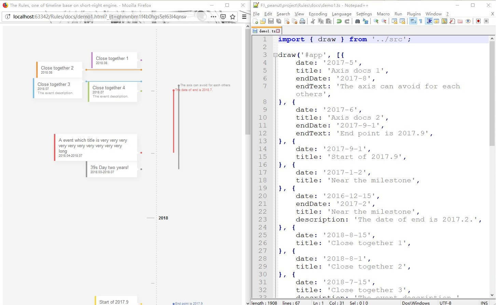

# Shot Night 

> The night is short, walk on girl.

http://short-night.pea3nut.org 

:deciduous_tree: An engine for drawing timeline graph.

# What is project doing?

An engine for draw a timeline graph:

- Which just given tiny info of events
- Which has directly proportional between time and space.
- Which can automatic fix the overlap



# Install

NPM

```
npm install short-night
```

# Usage

```Javascript
import * as Engine from 'short-night';
```
### For Creating Axis
Create Axis Clasess same as below pattern. For AxisBody Extens `Engine.AxisBody`, AxisMilestone Extens `Engine.AxisMilestone`, AxisScale Extens `Engine.AxisScale`
```
import * as Engine from 'short-night';

export default class AxisBody extends Engine.AxisBody {
    theme = 'theme-name-which-you-want';

    draw() {
        return super.draw();
    }
}
```

```javascript
import * as Engine from 'short-night';
import AxisBody from './AxisBody';
import AxisMilestone from './AxisMilestone';
import AxisScale from './AxisScale';

export default class Axis extends Engine.Axis {
    theme: string = 'theme-name-which-you-want'; 

    bodyConstructor: typeof Engine.AxisBody = AxisBody;
    milestoneConstructor: typeof Engine.AxisMilestone = AxisMilestone;
    scaleConstructor: typeof Engine.AxisScale = AxisScale;
}
```

### For Creating Event

Create Event Clasess same as below pattern. For EventAxis Extens `Engine.EventAxis`, EventBody Extens `Engine.EventBody`, EventMark Extens `Engine.EventMark`

```javascript
import * as Engine from 'short-night';

export default class EventAxis extends Engine.EventAxis {
    
    theme = 'theme-name-which-you-want';

    draw() {
        return super.draw();
    }
}
```

```javascript
import * as Engine from 'short-night';
import EventBody from './EventBody';
import EventAxis from './EventAxis';
import EventMark from './EventMark';

export default class Event extends Engine.Event {
    theme = 'theme-name-which-you-want';

    bodyConstructor: typeof Engine.EventBody = EventBody;
    axisConstructor: typeof Engine.EventAxis = EventAxis;
    markConstructor: typeof Engine.EventMark = EventMark;
}

```


### Create Timeline Class

```javascript
export default class Timeline extends Engine.Timeline {
 
    theme = 'theme-name-which-you-want';

    constructor() {
        .
        .
        .
    }

    axisConstructor = Axis;
    eventConstructor = Event;
}
```


```javascript
import * as Engine from 'short-night';
.
.
.
export const draw = Engine.createDraw<Timeline, typeof Timeline>('roshan-demo', Timeline);
````

```javascript
(async function () {
    const timeline = await draw('#app', [
        {
            date: '',
            endDate: '',
            title: '',
            description: ''
        }
    ]);
    const data = timeline.export();

    timeline.destroy();

    draw('#app', data)

}());
```


# Documents

Wanna using a timeline? click [here](http://short-night.pea3nut.org/example)

Wanna to develop a new timeline? click [here](https://github.com/FoXZilla/short-night/wiki)

